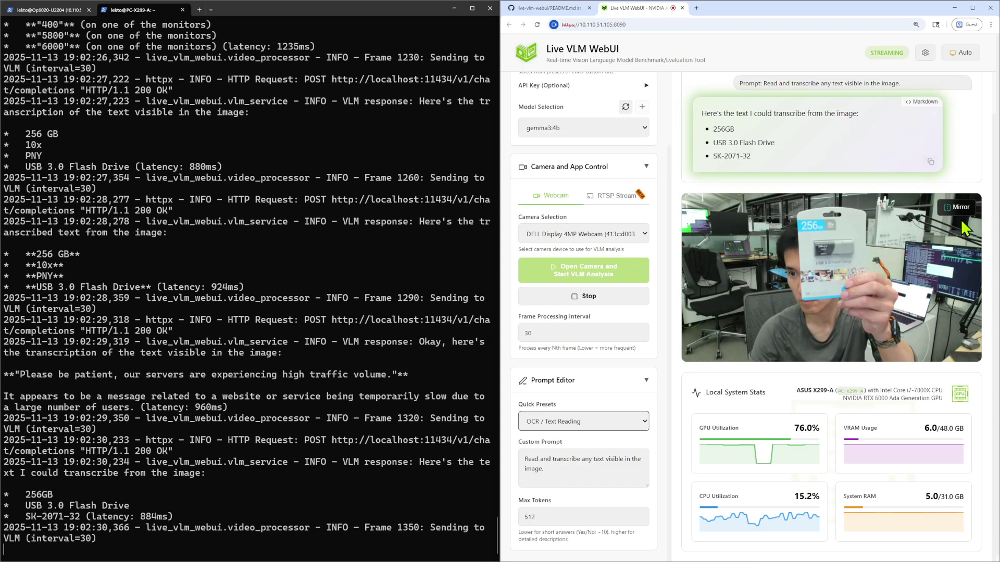
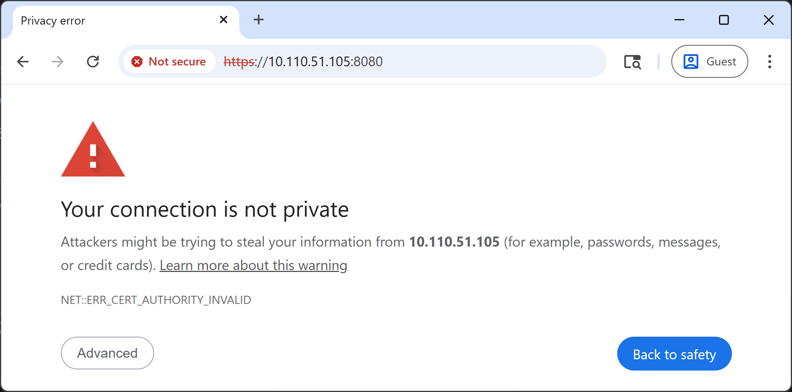
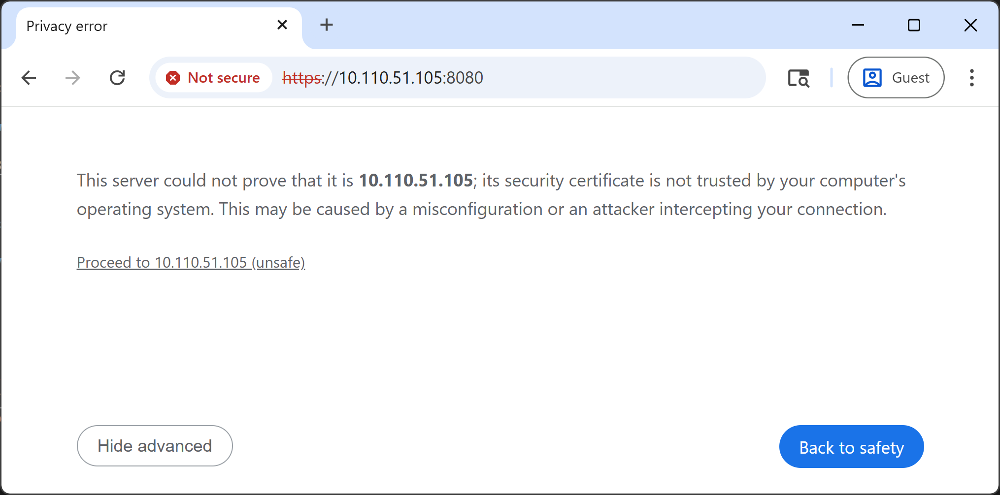
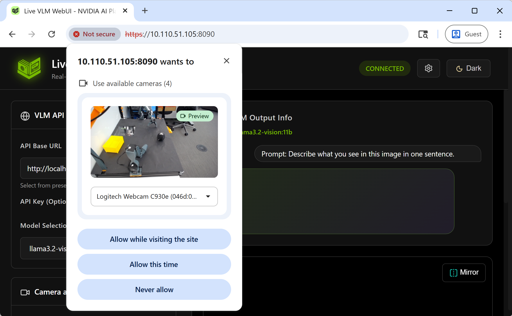
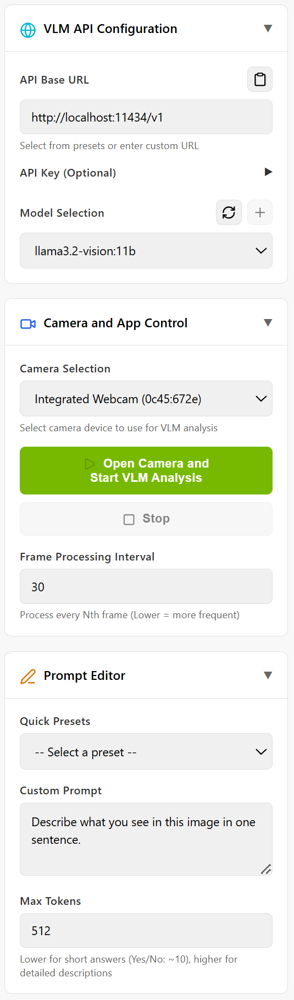
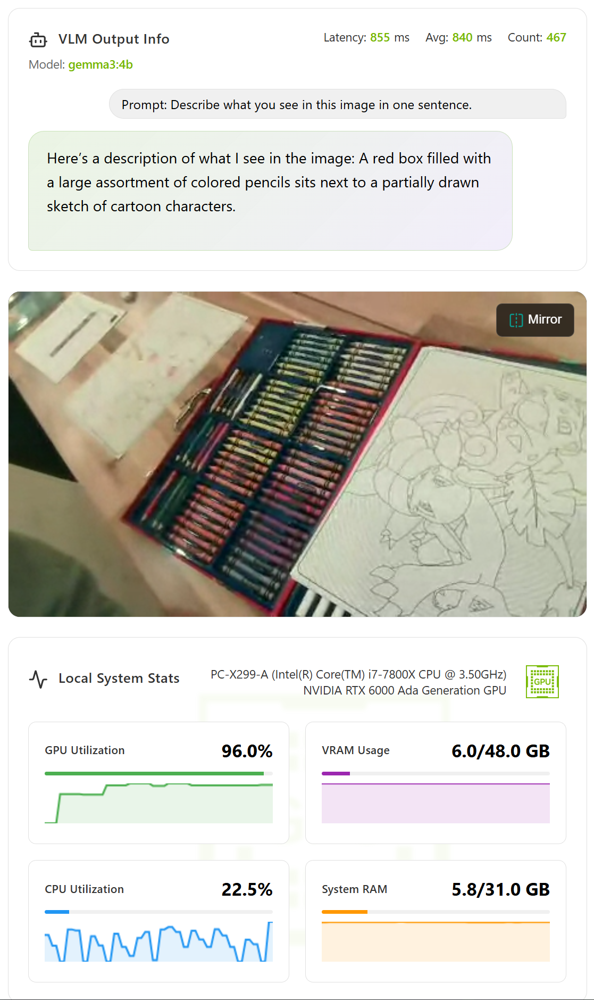
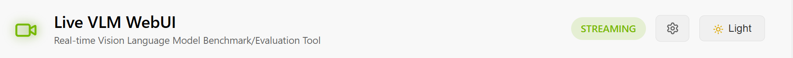

# Live VLM WebUI

[](https://github.com/nvidia-ai-iot/live-vlm-webui/stargazers)
[](https://github.com/nvidia-ai-iot/live-vlm-webui/network/members)
[](https://github.com/NVIDIA-AI-IOT/live-vlm-webui/actions/workflows/docker-publish.yml)
[](https://github.com/nvidia-ai-iot/live-vlm-webui/issues)
[](https://github.com/nvidia-ai-iot/live-vlm-webui/blob/main/LICENSE)
[](https://github.com/nvidia-ai-iot/live-vlm-webui/pkgs/container/live-vlm-webui)

**A universal web interface for real-time Vision Language Model interaction and benchmarking.**

Stream your webcam to any VLM and get live AI-powered analysis - perfect for testing models, benchmarking performance, and exploring vision AI capabilities across multiple domains and hardware platforms.

<picture>
  <source media="(prefers-color-scheme: dark)" srcset="docs/images/chrome_app-running_dark-theme.jpg">
  <source media="(prefers-color-scheme: light)" srcset="docs/images/chrome_app-running_light-theme.jpg">
  
</picture>

<details>
<summary><b>🎥 Install + Demo Video</b> (Click to expand)</summary>

**Watch the demo:** See Live VLM WebUI in action with webcam image with real-time AI analysis

[](https://github.com/user-attachments/assets/47a920da-b943-4494-9b28-c4ea86e192e4)

</details>

> [!TIP]
> **⭐ If you find this project useful, please consider giving it a star!** It helps others discover this tool and motivates us to keep improving it. Thank you for your support! 🙏

**📢 Share this project:**
[](https://twitter.com/intent/tweet?text=Check%20out%20Live%20VLM%20WebUI%20-%20A%20universal%20web%20interface%20for%20real-time%20Vision%20Language%20Model%20interaction!&url=https://github.com/nvidia-ai-iot/live-vlm-webui&hashtags=AI,VisionAI,NVIDIA,OpenSource)
[](https://www.linkedin.com/sharing/share-offsite/?url=https%3A%2F%2Fgithub.com%2Fnvidia-ai-iot%2Flive-vlm-webui)
[](https://reddit.com/submit?url=https://github.com/nvidia-ai-iot/live-vlm-webui&title=Live%20VLM%20WebUI%20-%20Real-time%20Vision%20AI%20Interaction)

---

## 🚀 Quick Start (Easiest Way!)

**For PC, Mac, DGX, and Jetson systems:**

```bash
pip install live-vlm-webui
live-vlm-webui
```

**Access the WebUI:** Open **`https://localhost:8090`** in your browser

> [!NOTE]
> **Requirements:**
> - **VLM Backend** - Ollama, vLLM, or cloud API. See [VLM Backend Setup](#-setting-up-your-vlm-backend)

**Platforms supported:**
- ✅ Linux PC (x86_64)
- ✅ DGX Spark (ARM64)
- ✅ macOS (Apple Silicon)
- ✅ Windows (via WSL2) - need to run Ollma on WSL. See [Windows WSL Setup Guide](./docs/usage/windows-wsl.md)
- ⚠️ **Jetson (Orin, Thor)** - pip works but Docker is simpler. See [Jetson Quick Start](#-jetson-quick-start) below

---

## ✈️ Jetson Quick Start

> [!IMPORTANT]
> **Requires JetPack 6.x** (Python 3.10+) or **JetPack 7.0** (Python 3.12).
> JetPack 5.x has Python 3.8 which is not supported - use Docker or upgrade.

### Option 1: Docker (Recommended - Works Out of the Box)

**For all Jetson platforms (Orin, Thor):**

```bash
# Clone the repository
git clone https://github.com/nvidia-ai-iot/live-vlm-webui.git
cd live-vlm-webui

# Run the auto-detection script (interactive mode)
./scripts/start_container.sh

# Or specify a version
./scripts/start_container.sh --version 0.2.0
```

The script auto-detects your platform, lets you choose a version, and starts the appropriate Docker container.

**Access the WebUI:** Open **`https://localhost:8090`** in your browser

> 📘 **Full Docker Guide:** [docs/setup/docker.md](docs/setup/docker.md)
> Includes manual commands, troubleshooting, network modes, and more.

**Platforms supported:**
- ✅ Linux PC (x86_64)
- ✅ DGX Spark (ARM64)
- ⚠️ macOS (Docker can't access localhost - use pip install instead)
- ❓ Windows WSL2 (Docker container not tested)
- ✅ **Jetson (Orin, Thor)** - works great

---

### Option 2: pip install (Advanced)

**For Jetson AGX Orin and Jetson Orin Nano (JetPack 6.x / r36.x):**

```bash
# Install dependencies
sudo apt install openssl python3-pip

# Install jetson-stats for GPU monitoring (optional but recommended)
# Note: Use --break-system-packages if on newer JetPack with Python 3.12
sudo pip3 install -U jetson-stats

# Install the package
python3 -m pip install --user live-vlm-webui

# Add to PATH (one-time setup)
echo 'export PATH="$HOME/.local/bin:$PATH"' >> ~/.bashrc
source ~/.bashrc

# Run it
live-vlm-webui
```

**For Jetson Thor (JetPack 7.0 / r38.2+):**

```bash
# Install dependencies
sudo apt install openssl pipx

# Ensure PATH for pipx
pipx ensurepath
source ~/.bashrc

# Install the package using pipx (required for Python 3.12)
pipx install live-vlm-webui

# Install jetson-stats for GPU monitoring (from GitHub - PyPI version doesn't support Thor yet)
# Step 1: Install system-wide for the jtop service
sudo pip3 install --break-system-packages git+https://github.com/rbonghi/jetson_stats.git
sudo jtop --install-service

# Step 2: Inject into pipx environment so live-vlm-webui can use it
pipx inject live-vlm-webui git+https://github.com/rbonghi/jetson_stats.git

# Step 3: Reboot for jtop service permissions to take effect
sudo reboot

# After reboot, run it
live-vlm-webui
```

> [!WARNING]
> **Ollama on Jetson Thor (JetPack 7.0)**
>
> Older Ollama versions (e.g. 0.12.10) can fail on Thor with GPU load errors. **Use the latest Ollama** for best Thor support:
> ```bash
> curl -fsSL https://ollama.com/install.sh | sh
> ```
>
> If you still see 500 / load EOF errors, see [Ollama GPU error on Jetson Thor](./docs/troubleshooting.md#ollama-gpu-error-on-jetson-thor-r382--jetpack-70) for diagnostics and workarounds (e.g. pin to 0.12.9 or use Ollama in Docker).

> [!NOTE]
> **Jetson Thor GPU Monitoring:** Thor support is in the latest jetson-stats on GitHub but not yet released to PyPI.
>
> **Why two installations?**
> 1. System-wide (`sudo pip3`) - Runs the jtop background service
> 2. Pipx environment (`pipx inject`) - Allows live-vlm-webui to access jtop data
>
> The reboot ensures proper socket permissions for jtop access.

> [!TIP]
> **Jetson Thor (Python 3.12):** Use `pipx` instead of `pip` due to PEP 668 protection.
> pipx automatically creates isolated environments for applications.
>
> **GPU Monitoring:** Installing `jetson-stats` enables proper hardware detection and GPU/VRAM monitoring.

**Access the WebUI:** Open **`https://localhost:8090`** in your browser

**Benefits of pip install:**
- ✅ Editable code for development
- ✅ Direct access to logs and debugging
- ✅ No container overhead
- ✅ Fine-grained control

**Note:** pip installation requires platform-specific setup steps. For production or simpler setup, use Docker (Option 1).

---

## 🎥 WebUI Usage

Once the server is running, access the web interface at **`https://localhost:8090`**

### Accepting the SSL Certificate

| 1️⃣ Click **"Advanced"** button | 2️⃣ Click **"Proceed to localhost (unsafe)"** | 3️⃣ Allow camera access when prompted |
|:---:|:---:|:---:|
|  |  |  |

### Interface Overview

**Left Sidebar Controls:**



#### **🌐 VLM API Configuration**
  - Set **API Base URL**, API Key, and **Model**
    - 🔄 Refresh models button - Auto-detect available models
    - ➕ Download button (coming soon)

#### **📹 Camera Control**
  - Dropdown menu lists all detected cameras
  - Switch cameras on-the-fly without restarting
  - **START/STOP** buttons for analysis control
  - **Frame Interval**: Process every N frames (1-3600)
    - Lower (5-30) = more frequent, higher GPU usage
    - Higher (60-300) = less frequent, power saving

#### **✍️ Prompt Editor**
  - 10+ preset prompts (scene description, object detection, safety, OCR, etc.)
  - Write custom prompts
  - Adjust **Max Tokens** for response length (1-4096)

<br clear="right">



**Main Content Area:**

#### **🤖 VLM Output Info** - Real-time analysis results:
  - Model name and inference latency metrics ⏱️
  - Current prompt display (gray box)
  - Generated text output

#### **🖼️ Video Feed** - Live webcam
  - mirror toggle button 🔄

#### **📈 System Stats Card** - Live monitoring:
  - System info: Hardware name with hostname with GPU info
  - GPU utilization and VRAM with progress bars
  - CPU and RAM stats
  - Sparkline graphs

<br clear="right">

**Header:**



- **Connection Status** - WebSocket connectivity indicator
- **⚙️ Settings** - Advanced configuration modal (WebRTC, latency thresholds, debugging)
- **🌙/☀️ Theme Toggle** - Switch between Light/Dark modes

---

## 💻 Development Installation (From Source)

**For developers, contributors, and those who want full control:**

```bash
# 1. Clone the repository
git clone https://github.com/nvidia-ai-iot/live-vlm-webui.git
cd live-vlm-webui

# 2. Create virtual environment
python3 -m venv .venv
source .venv/bin/activate

# 3. Upgrade pip and install in editable mode
pip install --upgrade pip setuptools wheel
pip install -e .

# 4. Start the server (SSL certs auto-generate)
./scripts/start_server.sh
```

**Access the WebUI:** Open **`https://localhost:8090`**

**Benefits of source installation:**
- ✅ Make code changes that take effect immediately (editable install)
- ✅ Access to development tools and scripts
- ✅ Works on macOS (unlike Docker which doesn't support webcam)
- ✅ Full debugging capabilities

**Platforms tested:**
- ✅ Linux (x86_64) - fully tested
- ✅ DGX Spark (ARM64) - fully tested
- ✅ Jetson Thor - fully tested
- ✅ Jetson Orin - fully tested
- ✅ macOS (Apple Silicon) - fully tested
- ⚠️ Windows - WSL2 recommended, native Windows requires additional setup (FFmpeg, build tools)

> [!TIP]
> For Jetson, we recommend Docker for production use. Source installation works but requires:
> `sudo apt install python3.10-venv` and careful pip management to avoid JetPack conflicts.

---

## 🤖 Setting Up Your VLM Backend

Choose the VLM backend that fits your needs:

> 📖 **Looking for specific models?** See the complete [List of Vision-Language Models](./docs/usage/list-of-vlms.md) across all providers.

### Quick Comparison

| Backend | Setup Difficulty | Model Coverage | GPU Required |
|---------|------------------|----------------|--------------|
| **Ollama** ✅    | 🟢 Easy   | 14+ vision models ([link](https://ollama.com/search?c=vision)) | 🏠 Yes (local) |
| **vLLM** ⚠️      | 🔴 Varies (works best on PC) | Widest HF model support | 🏠 Yes (local) |
| **NVIDIA NIM** ⚠️ | 🟡 Medium | Limited VLM selection (improving) | 🏠 Yes (local) |
| **NVIDIA API Catalog** ✅ | 🟢 Easy | 12+ hosted VLMs     | ☁️ No (cloud) |
| **OpenAI API** ⚠️        | 🟢 Easy | GPT-4o, GPT-4o-mini | ☁️ No (cloud) |

> **Legend**: ✅ Tested | ⚠️ Has auto-detection but not fully validated

### Option A: Ollama (Recommended for Beginners)

```bash
# Install from https://ollama.ai/download
# Pull a vision model
ollama pull llama3.2-vision:11b

# Start server
ollama serve
```

**Best for:** Quick start, easy model management

### Option B: vLLM (Recommended for Performance)

```bash
# Install vLLM
pip install vllm

# Start server
python -m vllm.entrypoints.openai.api_server \
  --model meta-llama/Llama-3.2-11B-Vision-Instruct \
  --port 8000
```

**Best for:** Production deployments, high throughput

### Option C: NVIDIA API Catalog (No GPU Required)

1. Visit [NVIDIA API Catalog](https://build.nvidia.com/)
2. Get API key on [build.nvidia.com](https://build.nvidia.com/settings/api-keys) page.
3. Configure in WebUI:
   - API Base: `https://integrate.api.nvidia.com/v1`
   - API Key: `nvapi-YOUR_KEY`
   - Model: `meta/llama-3.2-90b-vision-instruct`

**Best for:** Cloud-based inference, instant access, free API trial usage

**📘 Detailed Guide:** [VLM Backend Setup](./docs/setup/vlm-backends.md)

---

## 🔧 Alternative Installation Methods

### Docker (Recommended for Production & Jetson)

**For PC, DGX Spark, and Jetson users who want containerized deployment:**

```bash
# 1. Clone the repository
git clone https://github.com/nvidia-ai-iot/live-vlm-webui.git
cd live-vlm-webui

# 2. Run the auto-detection script
./scripts/start_container.sh

# Or specify a version
./scripts/start_container.sh --version 0.2.0

# List available versions
./scripts/start_container.sh --list-versions
```

**Benefits:**
- ✅ No dependency management
- ✅ Isolated environment
- ✅ Works across all platforms (x86_64, ARM64, Jetson)
- ✅ Production-ready
- ✅ Version pinning support

**Version Selection:**

The script supports multiple ways to select a version:
- **Interactive mode**: Shows available versions and lets you pick (default)
- **Specific version**: `--version 0.2.0` to pin to a specific release
- **Latest version**: `--version latest` or `--skip-version-pick` for newest
- **List versions**: `--list-versions` to see all available tags

**Available pre-built images:**

| Platform | Latest Tag | Versioned Tag Example |
|----------|------------|----------------------|
| **PC (x86_64) / DGX Spark** | `latest` | `0.2.0` |
| **Jetson Orin** | `latest-jetson-orin` | `0.2.0-jetson-orin` |
| **Jetson Thor** | `latest-jetson-thor` | `0.2.0-jetson-thor` |
| **macOS (testing)** | `latest-mac` | `0.2.0-mac` |

> [!TIP]
> The base tags (`latest`, `0.2.0`) are **multi-arch images** that automatically select the correct architecture:
> - `linux/amd64` for x86_64 PC and DGX systems
> - `linux/arm64` for DGX Spark (ARM64 SBSA server)

**📘 Detailed Guide:** [Docker Deployment Guide](./docs/setup/docker.md)

---

### Docker Compose (Complete Stack with VLM Backend)

**For PC and DGX Spark users who want VLM + WebUI in one command:**

> [!TIP]
> `start_docker_compose.sh` automatically detects your platform, checks Docker installation, and selects the correct profile. Just run it!

### With Ollama (Easiest, No API Keys Required)

**Using the launcher script (recommended):**
```bash
./scripts/start_docker_compose.sh ollama

# Pull a vision model after startup
docker exec ollama ollama pull llama3.2-vision:11b
```

**Or manually with docker compose:**
```bash
docker compose --profile ollama up

# Pull a vision model
docker exec ollama ollama pull llama3.2-vision:11b
```

> [!TIP]
> Backend-centric profiles make it easy: `--profile ollama`, `--profile vllm` (future), etc.

Includes:
- ✅ Ollama for easy model management
- ✅ Live VLM WebUI for real-time interaction
- ✅ No API keys required

### With NVIDIA NIM + Cosmos-Reason1-7B (Advanced)

> [!TIP]
> Cosmos-Reason1-7B is the default NIM model because it's the only NVIDIA VLM NIM that supports both x86_64 (PC) and ARM64 (DGX Spark, Jetson Thor) architectures. Other NIM models like Llama-3.2-90B-Vision and Nemotron are x86_64-only.

**Using the launcher script (recommended):**
```bash
# Get NGC API Key from https://org.ngc.nvidia.com/setup/api-key
export NGC_API_KEY=<your-key>

./scripts/start_docker_compose.sh nim
```

**Or manually with docker compose:**
```bash
export NGC_API_KEY=<your-key>
docker compose --profile nim up
```

Includes:
- ✅ NVIDIA NIM serving Cosmos-Reason1-7B with reasoning capabilities
- ✅ Production-grade inference
- ✅ Advanced VLM with planning and anomaly detection

> [!IMPORTANT]
> NIM requires NGC API Key and downloads ~10-15GB on first run. Requires NVIDIA driver 565+ (CUDA 12.9 support).

**📘 Detailed Guide:** [Docker Compose Setup Details](./docs/setup/docker-compose-details.md)

---

## 📚 Documentation

### For Users
- 📖 [VLM Backend Setup](./docs/setup/vlm-backends.md) - Detailed guide for Ollama, vLLM, SGLang, NVIDIA API
- 🤖 [List of Vision-Language Models](./docs/usage/list-of-vlms.md) - Comprehensive catalog of VLMs across Ollama, NVIDIA, OpenAI, Anthropic
- 📹 [RTSP IP Camera Setup](./docs/usage/rtsp-ip-cameras.md) - 🧪 Beta feature for continuous monitoring (tested: Reolink RLC-811A)
- 🐋 [Docker Compose Details](./docs/setup/docker-compose-details.md) - Complete stack setup with Ollama or NIM
- 🛠️ [Docker Deployment Guide](./docs/setup/docker.md) - Complete Docker setup and troubleshooting
- ⚙️ [Advanced Configuration](./docs/usage/advanced-configuration.md) - Performance tuning, custom prompts, API compatibility

### For Developers
- 🔨 [Building Docker Images](./docs/development/building-images.md) - Build platform-specific images for GHCR
- 🧑‍💻 [Contributing Guide](./CONTRIBUTING.md) - How to contribute to the project

### Help & Support
- 🚑 [Troubleshooting Guide](./docs/troubleshooting.md) - Common issues and solutions
- 💬 [GitHub Issues](https://github.com/nvidia-ai-iot/live-vlm-webui/issues) - Bug reports and feature requests
- 🌐 [NVIDIA Developer Forums](https://forums.developer.nvidia.com/) - Community support

---

## ✨ Key Features

### Core Functionality
- 🎥 **Multi-source video input**
  - WebRTC webcam streaming (stable)
  - 🧪 RTSP IP camera support (Beta - tested with Reolink RLC-811A)
- 🔌 **OpenAI-compatible API** - Works with vLLM, SGLang, Ollama, TGI, or any vision API
- 📝 **Interactive prompt editor** - 10+ preset prompts + custom prompts
- ⚡ **Async processing** - Smooth video while VLM processes frames in background
- 🔧 **Flexible deployment** - Local inference or cloud APIs

### UI & Visualization
- 🎨 **Modern NVIDIA-themed UI** - Professional design with NVIDIA green accents
- 🌓 **Light/Dark theme toggle** - Automatic preference persistence
- 📊 **Live system monitoring** - Real-time GPU, VRAM, CPU, RAM stats with sparkline charts
- ⏱️ **Inference metrics** - Live latency tracking (last, average, total count)
- 🪞 **Video mirroring** - Toggle button overlay on camera view
- 📱 **Compact layout** - Single-screen design

### Platform Support
- 💻 **Cross-platform monitoring** - Auto-detects NVIDIA GPUs (NVML), Apple Silicon
- 🖥️ **Dynamic system detection** - CPU model name and hostname
- 🔒 **HTTPS support** - Self-signed certificates for secure webcam access
- 🌐 **Universal compatibility** - PC (x86_64), DGX Spark (ARM64 SBSA), Jetson (Orin, Thor), Mac
- 🏗️ **Multi-arch Docker images** - Single image works across x86_64 and ARM64 architectures

---

## 🗺️ Use Cases

- 🔒 **Security** - Real-time monitoring and alert generation
- 🤖 **Robotics** - Visual feedback for robot control
- 🏭 **Industrial** - Quality control, safety monitoring, automation
- 🏥 **Healthcare** - Activity monitoring, fall detection
- ♿ **Accessibility** - Visual assistance for visually impaired users
- 📚 **Education** - Interactive learning experiences
- 🎬 **Content Creation** - Live scene analysis for video production
- 🎮 **Gaming** - AI game master or interactive experiences

---

## 🚑 Troubleshooting

### Quick Fixes

**Camera not accessible?**
- Use HTTPS (not HTTP): `./scripts/start_server.sh` or `--ssl-cert cert.pem --ssl-key key.pem`
- Accept the self-signed certificate warning (Advanced → Proceed)

**Can't connect to VLM?**
- Check VLM is running: `curl http://localhost:8000/v1/models` (vLLM) or `curl http://localhost:11434/v1/models` (Ollama)
- Use `--network host` in Docker for local VLM services

**GPU stats show "N/A"?**
- PC: Add `--gpus all` when running Docker
- Jetson: Add `--privileged -v /run/jtop.sock:/run/jtop.sock:ro`

**Slow performance?**
- Use smaller model (gemma3:4b instead of gemma3:11b)
- Increase Frame Processing Interval (60+ frames)
- Reduce Max Tokens (50-100 instead of 512)


## 🤝 Contributing

We ❤️ contributions from the community! This project is built with passion and we'd love your help making it even better.

**How you can help:**
- ⭐ **Star this repo** - It really helps us and takes just 1 second!
- 🐛 **Report bugs** - Found an issue? [Let us know](https://github.com/nvidia-ai-iot/live-vlm-webui/issues)
- 💡 **Suggest features** - Have an idea? [Create a feature request](https://github.com/nvidia-ai-iot/live-vlm-webui/issues/new)
- 🔧 **Submit PRs** - Code contributions are always welcome!
- 📢 **Share it** - Tell others about this project
- 📝 **Improve docs** - Help us make the documentation better

**Areas for improvement:**
- 📏 **Jetson VRAM utilization** - Workaround for measuring GPU memory consumption
- ⚡ **Hardware-accelerated video processing on Jetson** - Use NVENC/NVDEC
- ➕ **Model download UI** - Ability to initiate backend's model donwload from Web UI
- 📜 **Log functionality** - Keep the past analysis results viewable
- 🏆 **Benchmark mode** - Side-by-side model comparison
- 👥 **Multi-session support** - Support multiple sessions for hosting

See [Contributing Guide](./CONTRIBUTING.md) for details.

> [!IMPORTANT]
> **⭐ Don't forget to star the repository if you found it helpful!** Your support means the world to us and helps demonstrate the value of this work to the community and our organization.

---

## 📦 Project Structure

```
live-vlm-webui/
├── src/
│   └── live_vlm_webui/       # Main Python package
│       ├── __init__.py       # Package initialization
│       ├── server.py         # Main WebRTC server with WebSocket support
│       ├── video_processor.py # Video frame processing and VLM integration
│       ├── gpu_monitor.py    # Cross-platform GPU/system monitoring
│       ├── vlm_service.py    # VLM API integration
│       └── static/
│           └── index.html    # Frontend web UI
│
├── scripts/                  # Bash scripts & utilities
│   ├── start_server.sh      # Quick start script with SSL
│   ├── stop_server.sh       # Stop the server
│   ├── start_container.sh   # Auto-detection Docker launcher
│   ├── stop_container.sh    # Stop Docker container
│   ├── start_docker_compose.sh # Docker Compose launcher
│   ├── generate_cert.sh     # SSL certificate generation
│   ├── build_multiarch.sh   # Multi-arch Docker build
│   └── build_multiarch_cuda.sh
│
├── docker/                   # Docker configuration
│   ├── Dockerfile            # x86_64 PC / DGX Spark (multi-arch)
│   ├── Dockerfile.jetson-orin # Jetson Orin
│   ├── Dockerfile.jetson-thor # Jetson Thor
│   ├── Dockerfile.jetson     # Generic Jetson
│   ├── Dockerfile.mac        # macOS (testing)
│   └── docker-compose.yml    # Unified stack (Ollama + NIM)
│
├── tests/                    # Unit tests
│   └── __init__.py
│
├── prototypes/               # Experimental/prototype scripts (not production)
│   ├── examples.sh
│   ├── test_mac_docker.sh
│   └── test_gpu_monitor_mac.py
│
├── docs/                     # Detailed documentation
│   ├── setup/                # Setup guides
│   ├── usage/                # Usage guides
│   ├── development/          # Developer guides
│   └── troubleshooting.md
│
├── pyproject.toml            # Modern Python packaging (PEP 621)
├── requirements.txt          # Python dependencies
├── requirements-dev.txt      # Development dependencies
├── MANIFEST.in               # Package data includes
├── README.md                 # This file
├── CONTRIBUTING.md           # Contribution guidelines
└── LICENSE                   # Apache 2.0 license
```

---

## 📄 License

This project is licensed under the **Apache License 2.0** - see the [LICENSE](LICENSE) file for details.

```
SPDX-FileCopyrightText: Copyright (c) 2025 NVIDIA CORPORATION & AFFILIATES. All rights reserved.
SPDX-License-Identifier: Apache-2.0
```

---

## 🙏 Acknowledgments

- Built with [aiortc](https://github.com/aiortc/aiortc) - Python WebRTC implementation
- Compatible with [vLLM](https://github.com/vllm-project/vllm), [SGLang](https://github.com/sgl-project/sglang), and [Ollama](https://ollama.ai/)
- Inspired by the growing ecosystem of open-source vision language models, including [NanoVLM](https://dusty-nv.github.io/NanoLLM/)

---

## 📝 Citation

If you use this in your research or project, please cite:

```bibtex
@software{live_vlm_webui,
  title = {Live VLM WebUI: Real-time Vision AI Interaction},
  year = {2025},
  url = {https://github.com/nvidia-ai-iot/live-vlm-webui}
}
```

---

## ⭐ Star History

**Thank you to everyone who has starred this project!** Your support drives us to keep improving and innovating. 🚀

[](https://star-history.com/#nvidia-ai-iot/live-vlm-webui&Date)

> **Haven't starred yet?** [Click here to give us a ⭐](https://github.com/nvidia-ai-iot/live-vlm-webui) — it takes just a second and helps us tremendously!
